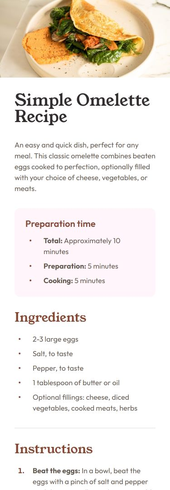

# Frontend Mentor - Recipe page solution

This is a solution to the [Recipe page challenge on Frontend Mentor](https://www.frontendmentor.io/challenges/recipe-page-KiTsR8QQKm). Frontend Mentor challenges help you improve your coding skills by building realistic projects. 

## Table of contents

- [Overview](#overview)
  - [Screenshot](#screenshot)
  - [Links](#links)
- [My process](#my-process)
  - [Built with](#built-with)
  - [What I learned](#what-i-learned)
  - [Continued development](#continued-development)
- [Author](#author)

## Overview

### Screenshot

### Links

- Solution URL: [Solution on GitHub](https://github.com/kwaeterinckx/FrontendMentorChallenge-RecipePage)
- Live Site URL: [Live version on Netlify](https://celebrated-sherbet-e36f79.netlify.app/)

## My process

### Built with

- Semantic HTML5 markup
- CSS custom properties
- Flexbox
- Mobile-first workflow

### What I learned

I learned how to organize my CSS more efficiently. I'm using custom properties and media-queries.  
This project also included some fonts. And instead of using the Google font option, I went for the @font-face.  
To avoid going up and down my CSS document, I created a seperate CSS file for my custom properties; fonts and media-queries.

I also learned to work with variable fonts.

### Continued development

I'll continue to focus on Flexboxes (Grids as well) and media-queries.  
Probably container-queries too since they offer more flexibility in responsiveness.

It was a very good challenge, even if it seems an easy layout challenge. There are various ways to solve this in CSS.  
I rewrote my code a couple of times before finding a correct solution to the responsiveness that was asked (desktop-mobile).  
And I'm proud of my *clean* code that resulted of my several attempts 🦚

## Author

Kévine Waeterinckx

- Frontend Mentor - [@kwaeterinckx](https://www.frontendmentor.io/profile/kwaeterinckx)
- GitHub - [kwaeterinckx](https://github.com/kwaeterinckx)
- LinkedIn - [Kévin Waeterinckx](https://www.linkedin.com/in/kévin-waeterinckx-58256518a)
